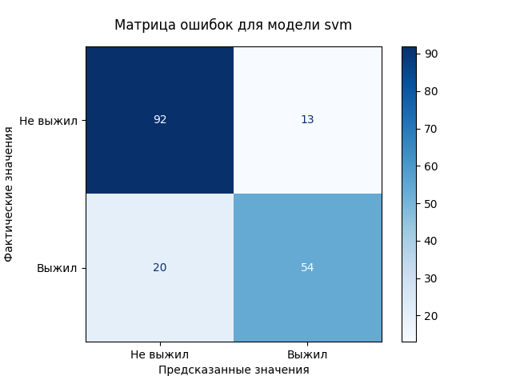
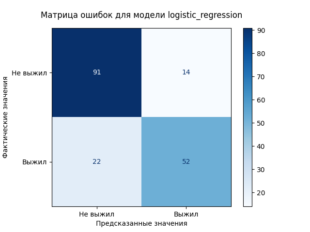
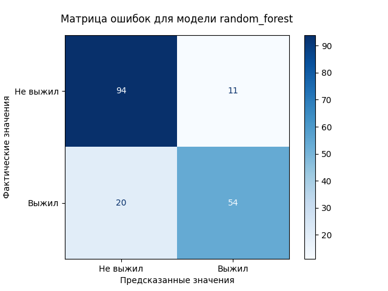
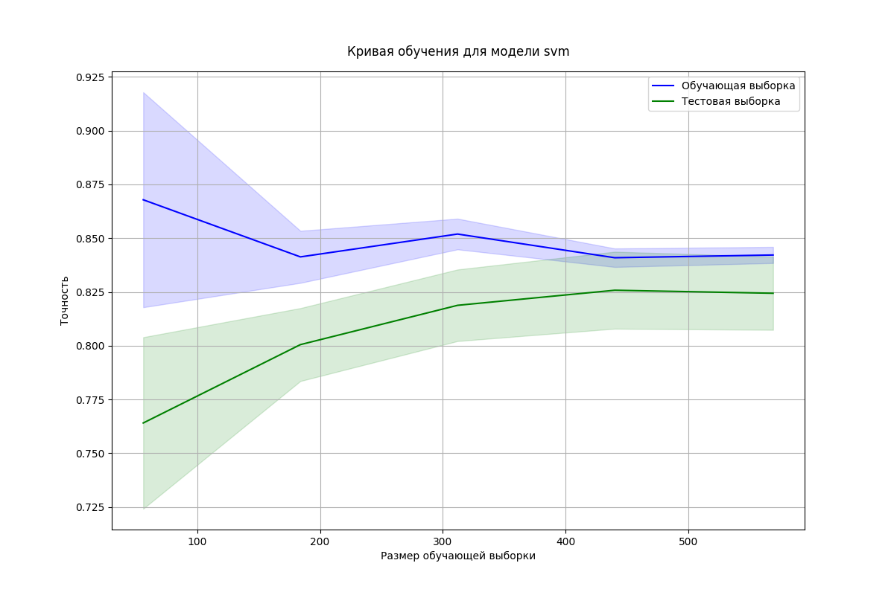
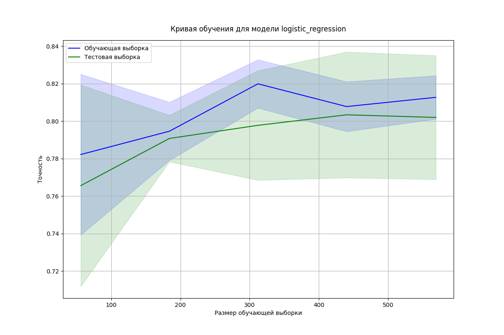
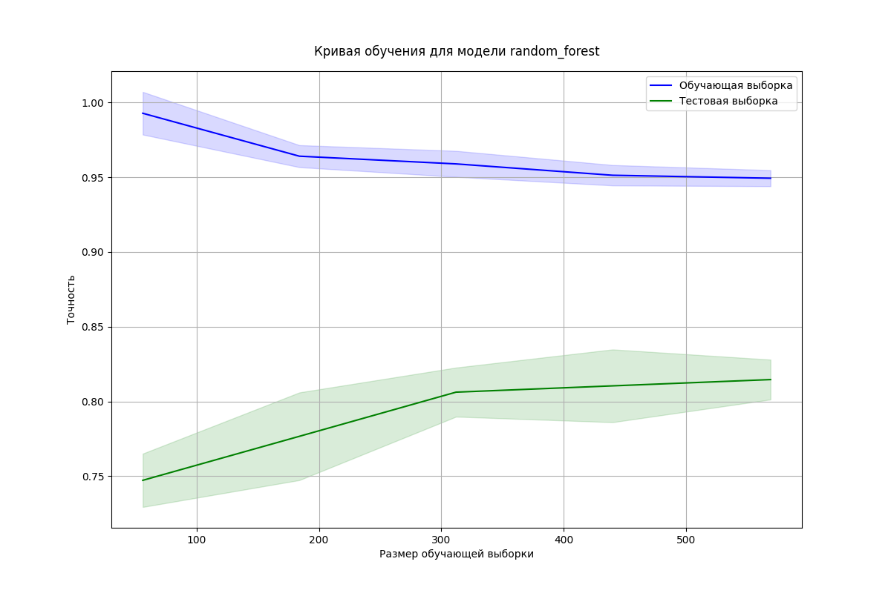

# Классификация датасета пассажиров Титаника методом опорных векторов <a href="https://opensource.org/licenses/MIT"></a>

## 1. Описание проекта
Данный проект был разработан в рамках дисциплины "МДК 13.01 Основы применения методов искусственного интеллекта в программировании".

**Практическое занятие №10**

**Тема:** Классификация с использованием метода опорных векторов (SVM) и сравнение с другими методами классификации.

В этом проекте реализованы различные модели машинного обучения (SVM, логистическая регрессия и случайный лес) для прогнозирования выживаемости пассажиров на Титанике. Проект включает в себя предварительную обработку данных, обучение моделей, настройку гиперпараметров, оценку производительности и визуализацию результатов. Основная цель - понять и применить SVM и сравнить его производительность с другими популярными алгоритмами классификации для этого конкретного набора данных.

## 2. Скриншоты
### 2.1. Скриншот выполненного задания
#### 2.1.1. Основной скрипт [main.py](src/main.py)
<p align="center">
  
</p>

### 2.2. Конспект лекции
<p align="center">
  
  
  
</p>

## 3. Методология и подходы
### 3.1. Методы

* **Загрузка данных:** Использовалась библиотека `pandas` для загрузки набора данных Titanic из CSV-файла.
* **Предварительная обработка данных:**
    * Обработка пропущенных значений с использованием `SimpleImputer` (медиана для числовых признаков и наиболее частое значение для категориальных признаков).
    * Кодирование категориальных признаков с использованием `OneHotEncoder`.
    * Масштабирование числовых признаков с использованием `StandardScaler`.
    * Использование `ColumnTransformer` для применения различных этапов предварительной обработки к разным столбцам.
* **Обучение моделей:** Обучение моделей SVM, логистической регрессии и случайного леса с использованием `scikit-learn`.
* **Источник:** `github.com/datasciencedojo/datasets/blob/master/titanic.csv`
* **Формат:** CSV
* **Описание:** Набор данных Titanic содержит информацию о пассажирах на Титанике, включая их возраст, пол, класс пассажира, тариф и статус выживания. Цель состоит в том, чтобы предсказать, выжил ли пассажир на основе этих признаков.

### 3.2. Предварительная обработка данных
* Пропущенные значения в столбце 'Age' были заполнены медианой.
* Категориальные признаки ('Sex', 'Embarked', 'Pclass') были преобразованы с использованием `one-hot encoding`.
* Числовые признаки ('Age', 'Fare', 'SibSp', 'Parch') были масштабированы с использованием `StandardScaler`.

### 3.3. Графики и диаграммы
#### 3.3.1. Матрица ошибок (SVM)
<p align="center">
  
</p>

#### 3.3.2. Матрица ошибок (Логистическая регрессия)
<p align="center">
  
</p>

#### 3.3.3. Матрица ошибок (Случайный лес)
<p align="center">
  
</p>

#### 3.3.4. Кривая обучения (SVM)
<p align="center">
  
</p>

#### 3.3.5. Кривая обучения (Логистическая регрессия)
<p align="center">
  
</p>

#### 3.3.6. Кривая обучения (Случайный лес)
<p align="center">
  
</p>

## 5. Анализ результатов
На основании вывода консоли были получены следующие результаты:

* **SVM:**
    * Начальная точность: `0.82`
    * Лучшие параметры (Grid Search): `{'C': 1, 'gamma': 'scale'}`
    * Лучшая оценка кросс-валидации: `0.8259`
    * Точность после настройки: `0.82`

* **Логистическая регрессия:**
    * Начальная точность: `0.80`
    * Лучшие параметры (Grid Search): `{'C': 0.1}`
    * Лучшая оценка кросс-валидации: `0.8062`
    * Точность после настройки: `0.80`

* **Случайный лес:**
    * Начальная точность: `0.82`
    * Лучшие параметры (Grid Search): `{'max_depth': 10, 'n_estimators': 200}`
    * Лучшая оценка кросс-валидации: `0.8132`
    * Точность после настройки: `0.83`


### 5.1. Отчеты о классификации

* **SVM:**
```
precision  recall f1-score  support

        0    0.82   0.88   0.85    105
        1    0.81   0.73   0.77    74

    accuracy              0.82    179
    macro avg    0.81   0.80   0.81    179
  weighted avg    0.82   0.82   0.81    179
```

* **Логистическая регрессия:**
```
precision  recall f1-score  support

        0    0.81   0.87   0.83    105
        1    0.79   0.70   0.74    74

    accuracy              0.80    179
    macro avg    0.80   0.78   0.79    179
  weighted avg    0.80   0.80   0.80    179
```

* **Случайный лес:**
```
precision  recall f1-score  support

        0    0.82   0.90   0.86    105
        1    0.83   0.73   0.78    74

    accuracy              0.83    179
    macro avg    0.83   0.81   0.82    179
  weighted avg    0.83   0.83   0.82    179
```

## 6. Выводы
В проекте успешно реализованы и сравнены три различные модели классификации (SVM, логистическая регрессия и случайный лес) для прогнозирования выживаемости на Титанике. Все модели достигли разумной точности, при этом случайный лес немного превзошел другие после настройки гиперпараметров. Отчеты о классификации показывают хороший баланс между точностью и полнотой для всех моделей. Кривые обучения (которые следует включить в раздел "Графики и диаграммы") дадут представление о том, переобучаются ли модели или недообучаются, и улучшит ли производительность увеличение объема данных.

## 7. Обсуждение возможных улучшений
* **Разработка признаков:** Изучите создание новых признаков из существующих, чтобы потенциально повысить производительность модели.
* **Более широкая настройка гиперпараметров:** Проведите более тщательный поиск оптимальных гиперпараметров с использованием таких методов, как RandomizedSearchCV.
* **Ансамблевые методы:** Изучите другие ансамблевые методы, такие как градиентный бустинг или стекинг, чтобы объединить сильные стороны различных моделей.
* **Кросс-валидация:** Применяйте кросс-валидацию во время настройки гиперпараметров для предотвращения переобучения.
* **Увеличение объема данных:** Если возможно, изучите методы увеличения объема набора данных для повышения устойчивости модели.

## 8. Заключение
Эта практическая работа предоставила ценный опыт применения методов машинного обучения для классификации, включая предварительную обработку данных, обучение моделей, настройку гиперпараметров и оценку производительности. Проект продемонстрировал эффективность SVM, логистической регрессии и случайного леса для прогнозирования выживаемости на Титанике и подчеркнул важность правильной предварительной обработки данных и оптимизации гиперпараметров для достижения оптимальных результатов.

## 9. Лицензия
Этот проект распространяется под лицензией MIT - смотрите файл [LICENSE](LICENSE) для деталей.

## 10. Автор
Бедин Владислав ([MindlessMuse666](https://github.com/MindlessMuse666))

* GitHub: [MindlessMuse666](https://github.com/MindlessMuse666 "Владислав: https://github.com/MindlessMuse666")
* Telegram: [@mindless_muse](t.me/mindless_muse)
* Gmail: [mindlessmuse.666@gmail.com](mindlessmuse.666@gmail.com)
